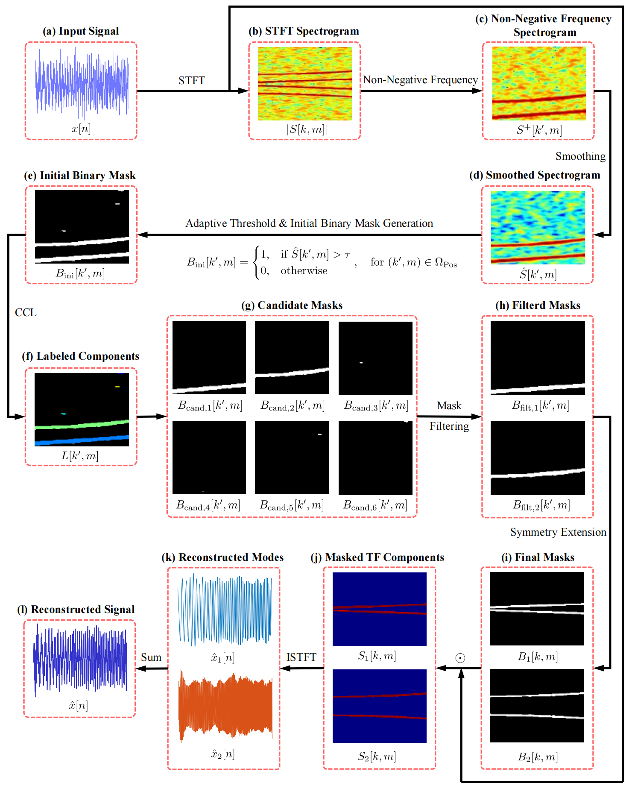

---

# STFT-based Time-Frequency Mode Decomposition: A Fast and Robust Method for Multicomponent Signal Analysis

This repository contains the official MATLAB implementation for **Time-Frequency Mode Decomposition (TFMD)**, a fast, robust, and adaptive framework for analyzing complex multicomponent signals, as presented in the paper by Zhou, Li, and Ren.

---

## Citation

If you use TFMD or this code in your research, please cite the following paper:

**Wei Zhou, Wei-Jian Li, Wei-Xin Ren. "STFT-based Time-Frequency Mode Decomposition: A Fast and Robust Method for Multicomponent Signal Analysis." arXiv preprint arXiv:2507.11919 [eess.SP], 2025.**

-   **arXiv Link:** [https://arxiv.org/abs/2507.11919](https://arxiv.org/abs/2507.11919)
-   **DOI:** [https://doi.org/10.48550/arXiv.2507.11919](https://doi.org/10.48550/arXiv.2507.11919)

**BibTeX:**
```bibtex
@misc{zhou2024stftbased,
      title={STFT-based Time-Frequency Mode Decomposition: A Fast and Robust Method for Multicomponent Signal Analysis}, 
      author={Wei Zhou and Wei-Jian Li and Wei-Xin Ren},
      year={2025},
      eprint={2507.11919},
      archivePrefix={arXiv},
      primaryClass={eess.SP}
}
```

## Abstract

> The decomposition of complex, multicomponent, and non-stationary signals into their constituent modes is a fundamental yet significant challenge in science and engineering. Existing methods often struggle with a trade-off among accuracy, computational cost, and the need for prior information such as the number of modes. This paper introduces time-frequency mode decomposition (TFMD), a novel framework for the fast, robust, and adaptive decomposition of such signals. TFMD operates on the principle that modes form contiguous high-energy regions in the time-frequency domain. Its non-iterative pipeline reframes signal decomposition as an image segmentation task: a signal is transformed into a spectrogram, which is then smoothed to enhance the continuity of these high-energy regions. A sequence of adaptive thresholding and connected-component labeling with size-based filtering is then employed to automatically segment the spectrogram and generate a mask for each mode. The modes are finally reconstructed via the inverse short-time Fourier transform. Validation on diverse synthetic signals demonstrates that TFMD accurately determines the number of modes and reconstructs them with high fidelity. Its performance is particularly strong in high-noise conditions. A comparative analysis confirms that TFMD provides robust, competitive performance across a wider variety of signal types, while a theoretical complexity analysis reveals its superior computational efficiency stemming from its non-iterative design. The method's practical utility is further demonstrated by successfully extracting modal responses from a real-world footbridge vibration signal. TFMD provides a computationally efficient and powerful paradigm for multicomponent signal analysis, offering a compelling balance of accuracy, versatility, and efficiency for large-scale or time-sensitive applications.

## Introduction

This project introduces **TFMD**, a novel method developed to address the challenges of decomposing complex signals. The framework is built on a central hypothesis: **constituent signal modes manifest as contiguous, high-energy regions in the time-frequency (TF) domain, which are structurally distinguishable from noise.**

TFMD reframes signal decomposition as an image segmentation task. The signal's spectrogram is processed through a direct, non-iterative pipeline that includes smoothing, adaptive thresholding, and connected-component labeling (CCL) to automatically generate a mask for each mode. These modes are then reconstructed via the inverse short-time Fourier transform (ISTFT).

The primary contributions of TFMD are:

-   ✅ **Computational Efficiency:** It utilizes a non-iterative framework with a quasi-linear theoretical time complexity, making it inherently more efficient than conventional iterative methods and suitable for large-scale or real-time data analysis.
-   🧠 **Data-Driven Adaptivity:** It automatically determines the number of modes by filtering candidate masks based on their size, eliminating the need for this critical parameter to be specified a priori—a common limitation of methods like VMD.
-   🛡️ **Inherent Robustness:** It integrates spectrogram smoothing and size-based mask filtering directly into the pipeline, providing intrinsic robustness to noise by design, particularly in high-noise scenarios.
-   ⚖️ **Versatility and Balance:** The methodology is conceptually straightforward and demonstrates a compelling balance of accuracy, efficiency, and general robustness across a diverse range of non-stationary signals.

## Methodology Flowchart

The core of the TFMD methodology is illustrated in the flowchart below. This process systematically identifies, separates, and reconstructs the intrinsic modes of a signal from its time-frequency plane.



*Figure 1: Flowchart of the proposed TFMD methodology. The process starts with (a) the input signal $x[n]$, which is transformed by the STFT to yield (b) the complex coefficients $S[k,m]$ and their corresponding spectrogram $|S[k,m]|$. The (c) non-negative frequency portion of the spectrogram is then (d) smoothed to produce a smoothed spectrogram $\hat{S}[k',m]$, which highlights high-energy TF regions. (e) An initial binary mask $B\_{\text{ini}}[k',m]$ is generated via adaptive thresholding. (f) Connected-component labeling (CCL) is applied to identify distinct regions of connected 1-valued pixels, assigning a unique label to each region in the labeled components $L[k',m]$. (g) These regions are isolated as candidate masks $B\_{\text{cand}, i}[k',m]$. These masks are then (h) filtered by size to remove masks that may be generated by noise artifacts, yielding a set of filtered masks $B\_{\text{filt}, i}[k',m]$. (i) The filtered masks are extended with frequency symmetry to create the final masks $B\_{i}[k,m]$. These are used to (j) extract the masked TF component for each mode from the original STFT coefficients. (k) Finally, ISTFT reconstructs each masked TF component into a time-domain mode, and (l) these modes are summed to synthesize the final reconstructed signal $\hat{x}[n]$.*

## File Structure

-   `tfmd.m`: The core function that implements the Time-Frequency Mode Decomposition algorithm.
-   `test.m`: A comprehensive test suite that demonstrates how to use `tfmd.m` on various signals.
-   `generate_signal.m`: A script to generate sample signals for testing purposes.
-   `Flowchart.png`: The source PNG file containing the detailed methodology flowchart.

## How to Use

### 1. Run the Full Test Suite

The easiest way to see the algorithm in action is to run the complete test suite, which evaluates TFMD on 6 different synthetic signals.

```matlab
% This script will generate signals, apply TFMD, calculate performance,
% and create figures for each case.
test;
```

### 2. Step-by-Step Usage

For custom use, follow these steps, which mirror the logic in `test.m`:

#### Step 1: Generate or Load a Signal
First, obtain your signal and sampling frequency `fs`. You can use the provided function to generate a sample signal.

```matlab
fs = 1000; % Sampling frequency in Hz
case_idx = 1; % For example, the first signal case
signal_data = generate_signal(case_idx, fs);
input_signal = signal_data.clean;
```

#### Step 2: Define TFMD Parameters
The `tfmd` function requires an options struct to control its behavior. You can define it as follows:

```matlab
% Define TFMD parameters
tfmd_options = struct();
tfmd_options.window_length = 128;          % STFT window length
tfmd_options.win_type = 'gaussian';        % Window type ('gaussian')
tfmd_options.alpha = 2.5;                  % Shape parameter for Gaussian window
tfmd_options.overlap_ratio = 115/128;      % Overlap ratio (e.g., 115/128 ≈ 89.8%)
tfmd_options.threshold_factor = 2.0;       % Adaptive thresholding factor
tfmd_options.min_component_size = 10;      % Absolute minimum size (in pixels) for a component
```

#### Step 3: Apply TFMD
Call the `tfmd` function with the signal, sampling frequency, and options.

```matlab
[decomposed_modes, reconstructed_signal] = tfmd(input_signal, fs, tfmd_options);
```

#### Step 4: Analyze the Results
The function returns the decomposed modes as a cell array and the signal reconstructed from these modes.

```matlab
fprintf('Found %d modes.\n', length(decomposed_modes));

% Plot the first decomposed mode
figure;
plot(signal_data.t, decomposed_modes{1});
title('First Decomposed Mode');
xlabel('Time (s)');
ylabel('Amplitude');
```

## Requirements

-   **MATLAB**
-   **Signal Processing Toolbox™**: Required for `stft`, `istft`, and windowing functions.
-   **Image Processing Toolbox™**: Required for connected-component labeling (`bwlabel` or `bwconncomp`).

## Contributing

Contributions are welcome! Please feel free to submit a pull request or open an issue.

## License

Consider adding an open-source license to your project by creating a `LICENSE` file.
